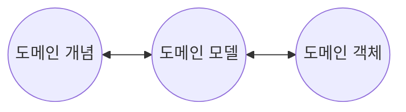
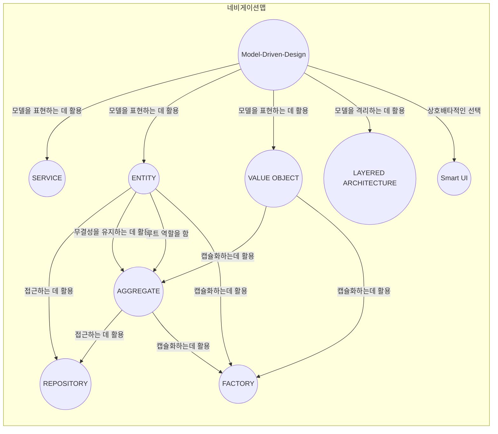

## 1 도메인 주도 설계란 무엇인가?

개발자는 소프트웨어 이용자의 세계에 대해 기본적으로 무지하다. 

그래서 개발자는 유용한 소프트웨어를 만들기 위해 이용자의 문제가 무엇인지 파악하고, 이를 해결할 수 있는 최선의 수단을 생각해야 한다.

[+도메인 주도 설계는 이러한 고찰을 반복하는 설계를 통해 이용자의 세계와 소프트웨어 구현을 연결 짓는 것이 목적이다.+]

## 2 도메인 지식에 초점을 맞춘 설계 기법

도메인이란 무엇인가? 도메인은 `영역`이란 뜻이다. 특히 소프트웨어 개발에서 말하는 도메인은 `프로그램이 쓰이는 대상 분야`라는 의미로 쓰인다.

예를 들어 회계 시스템에서 도메인은 금전 혹은 장부 같은 개념이다.

그리고 물류 시스템에서는 화물이나 창고, 운송수단 등의 개념이 도메인에 속한다.

소프트웨어에는 반드시 이용자가 있고 소프트웨어의 목적은 도메인에서 이용자들이 직면한 문제를 해결해야 한다. 이용자의 문제를 해결하기 위해서는 개발자는 `이용자의 문제를 정확히 이해 해야 한다.`

### 2.1 도메인 모델링이란 무엇인가?

모델은 현실에서 일어나는 사건 혹은 개념을 추상화한 개념이다. 추상이란 여러 사물 혹은 개념에서 공통적인 것을 뽑아 파악하는 것이다.

예를 들어, 트럭은 `화물을 나를 수 있다.`는 성질만 표현해도 충분하다. `차 키를 돌리면 엔진에 시동이 걸린다.`와 같은 정보까지 나타낼 필요는 없다.

이렇게 `사건 혹은 개념을 추상화 하는 작업을 모델링이라고 한다.`

### 2.2 지식을 코드로 나타내는 도메인 객체

소프트웨어 이용자의 요구사항은 바뀌기 쉽고, 시간에 따라 변화하기 쉽다. 이럴 때 도메인 객체가 도메인 모델을 충분히 반영하고 있다면 도메인의 변화를 코드로 쉽게 옮길 수 있다.

도메인 개념의 변화는 도메인 객체까지 연쇄적으로 전달 된다.

반대로, 도메인 객체가 도메인의 대한 태도를 변화시키는 경우도 있는데, 이는 도메인 개념이 어중간하면 프로그램에 의해 도메인 개념이 변화 할 수도 있다.

이 처럼 서로 영향을 주고 받으면 반복적으로 개발되어야 한다.

## 3. 도메인 주도 설계의 대표적인 패턴

* 지식을 표현하기 위한 패턴
  - 값 객체(Value Object)
  - 엔티티(Entity)
  - 도메인 서비스(Domain Service)

* 애플리케이션을 구성하는 패턴
  - 리포지토리(Repository)
  - 애플리케이션 서비스(Application Service)
  - 팩토리(Factory)
* 지식 표현을 위한 고급 패턴
  - 애그리게이트(Aggregate)
  - 명세(Satisfied)