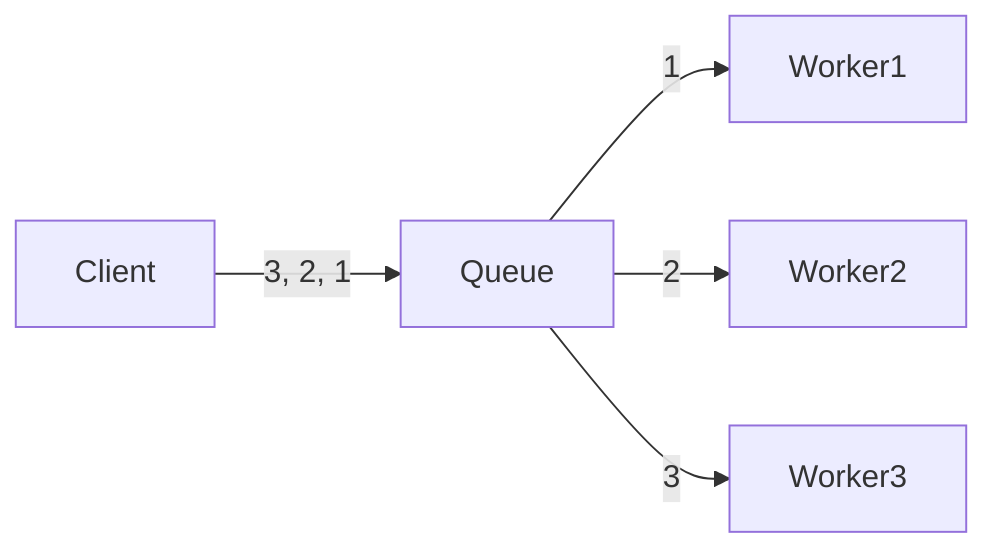

## 소개

Redis는 `Key, Value` 구조의 비정형 데이터를 저장하고 관리하기 위한 오픈 소스 기반의 비관계형 데이터베이스 관리 시스템(DBMS)입니다.

데이터베이스, 캐시, 메시지 브로커로 사용되며 인메모리 데이터 구조를 가진 저장소입니다.

많이들 Redis의 자료구조 중 List를 가지고 Queue나 Stack을 만들어 사용합니다.

속도는 O(n)의 속도를 가지며 이 포스트에서는 Job Queue를 만들어 Message Queue 처럼 사용하는 방법에 대해 소개하도록 하겠습니다.



## Redis Nuget Package

.NET에서 Redis를 지원하는 패키지는 많이 있으나 가장 많이 사용하는 `StackExchange.Redis`를 사용하여 구연하도록 하겠습니다.

## Redis 연결

`StackExchange.Redis`로 Redis에 연결하기 위해서는 아래와 같은 방법으로 Connection을 생성하면 됩니다.

```
ConnectionMultiplexer.Connect("localhost:6379");
```

Connection이 생성 되었다면 아래와 같이 메서드를 정의 할 수 있습니다.

```cs
public void Enqueue(string value)
{
    _connection.GetDatabase().ListLeftPush(_queueName, value.ToString());
}

public string Dequeue()
{
    var result = _connection.GetDatabase().ListRightPop(_queueName);
    return result.ToString();
}
```

`Enqueue`의 경우 List의 왼쪽에 Push를 하고 `Dequeue`의 경우 오른쪽에서 Pop을 하면 됩니다.

> Stack 구현 시 Push의 경우 `ListLeftPush` Pop의 경우 `ListLeftPop`을 하면 되겠죠?

#### 메시지 삭제

Redis의 경우 Message Queue 처럼 사용하지만 중간의 데이터를 삭제 할 수 있습니다.

예를 들어 RabbitMQ의 경우는 메시지를 Publish하면 메시지를 Queue에서 강제로 삭제가 불가능합니다.

하지만 Redis는 List이기 때문에 O(n)의 속도로 삭제가 가능합니다.

```cs
public int Remove(string value, long count = 1)
{
    var removeItems = _connection.GetDatabase().ListRemove(_queueName, value.ToString(), count);
    return Convert.ToInt32(removeItems);
}
```

`ListRemove`를 사용하면 삭제가 가능하며 count는 삭제하려는 value를 몇개까지 지우는지 설정합니다.

## 예제 소스

[https://github.com/Jandari91/Redis-.NET](https://github.com/Jandari91/Redis-.NET)

#### 예제 소스 설명

Client-WPF의 경우 WPF로 만들었고 textbox에 글자를 넣고 Input 버튼을 누르면 Redis로 Message가 Enqueue 됩니다.

그리고 WorkerService는 위 그림과 같이 메시지를 하나하나씩 가져와 처리됩니다.

docker-compose.yml은 아래와 같이 정의하여 Worker를 3개 띄우도록 하였습니다.

```yml
version: '3.4'

services:
  workerservice:
    image: ${DOCKER_REGISTRY-}workerservice
    build:
      context: .
      dockerfile: WorkerService/Dockerfile

  workerservice2:
    image: ${DOCKER_REGISTRY-}workerservice
    build:
      context: .
      dockerfile: WorkerService/Dockerfile
  workerservice3:
    image: ${DOCKER_REGISTRY-}workerservice
    build:
      context: .
      dockerfile: WorkerService/Dockerfile

  redis:
    image : redis:latest
    ports:
    - 6379:6379
```