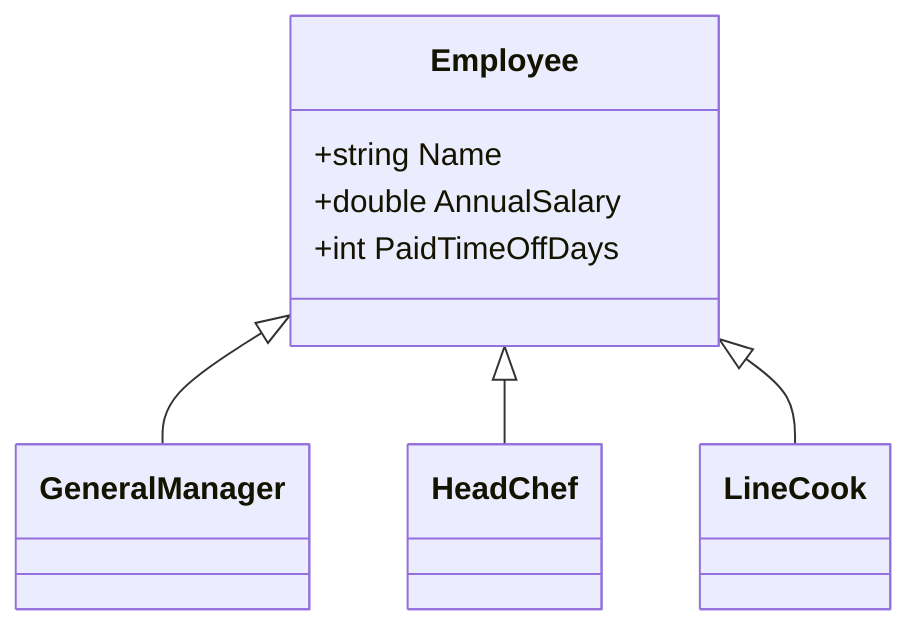

# 소개

패턴을 활용한 리팩터링이라는 책에서 Switch 문을 좀더 객체지향적인, 다향성을 이용하도록 리팩터링 하기 위해서 Visitor 패턴을 도입하면, 조건 로직도 필요 없어지고 설계도 더 융통성 있게 할 수 있다고 소개한다.

## 방문자 패턴(Visitor Pattern)

Visitor는 사전적인 의미로 어떤 장소에 찾아오는 사람이라는 의미를 가지고 있다. 방문자 패턴에서는 데이터 구조와 처리를 분리한다.

데이터 구조 안을 돌아다니는 주체인 방문자를 나타내는 클래스를 준비해서 처리를 맡긴다. 새로운 처리를 추가하고 싶을 땐 새로운 방문자를 만들고 데이터 구조는 방문자를 받아들이면 된다.

방문자 패턴은 `개방-패쇠 원칙`을 적용하는 방법 중 한 가지 입니다.

* 확장에 대해 열려있다.
  * 클래스를 설계할 때, 특별한 이유가 없는 한 확장을 금지해서는 안된다.
* 수정에 대해 닫혀있다.
  * 확장 할 때 마다 기존의 클래스를 수정하면 안된다.


* `Visitor`은 객체 구조의 각 ConcreteElement에 대한 메서드을 정의합니다.
* `ConcreteVisitor`은 Visitor에 의해 정의된 각 메서드를 구현합니다. 각 메서드는 해당 개체에 필요한 알고리즘을 구현합니다.
* `Eelement`는 Visitor를 인수로 사용하는 Accept 메서드를 정의 합니다.
* `ConcreteElement`는 방문자를 인수로 하는 Accept 메서드를 구현합니다.
* `ObjectStructure`는 Element를 열거할 수 있으며 Visitor가 Element를 방문할 수 있도록 높은 수준의 인터페이스를 제공합니다.


## 예시

맛집 레스토랑을 예시로 설명을 해보도록 하겠습니다. 직원들이 열심히 일을 해 손님들이 항상 꽉차고 매출도 많이 오른 레스토랑이 있습니다.

그래서 사장은 보너스와 휴가를 줌으로써 직원들에게 보상하려고 합니다.

하지만 이미 아래와 같이 직원의 클래스가 이미 만들어져 있습니다.




우리는 여기서 직원들의 보너스와 추가 휴가에 대해 계산하여 출력하려 합니다.

물론 List에 모든 직원들을 넣어 반복문을 돌면서 보너스를 계산하는 메서드, 추가 휴가를 계산하는 메서드를 만들 수 있습니다.

하지만 Visitor 패턴을 사용하게 되면 좀 더 객체지향적으로 계산할 수 있으며, 추후 다른 필요한 계산에 대해 모듈을 만들어 추가 및 삭제가 용이하게 만들 수 있습니다.

```cs
public interface IVisitor
{
    void Visit(IElement element);
}

public interface IElement
{
    void Accept(IVisitor visitor);
}
```

```cs
public class IncomeVisitor : IVisitor
{
    public void Visit(IElement element)
    {
        Employee employee = (Employee)element;

        employee.AnnualSalary *= 1.10;
        Console.WriteLine("{0} {1}' new income: {2:C}", employee.GetType().Name, employee.Name, employee.AnnualSalary);
    }
}

public class PaidTimeOffVisitor : IVisitor
{
    public void Visit(IElement element)
    {
        Employee employee = (Employee)element;

        employee.PaidTimeOffDays += 3;
        Console.WriteLine("{0} {1}'s new vacation days: {2}", employee.GetType().Name, employee.Name, employee.PaidTimeOffDays);
    }
}
```

* IncomeVisitor : 보너스 계산에 쓰입니다.
* PaidTimeOffVisitor : 추가 휴가에 쓰입니다.

위와 같이 Visitor를 따로따로 만들어 필요할때마다 가져다 사용하면 됩니다.

기존의 Employee 클래스는 `IElement`를 상속 받아 구현합니다.
```cs
public class Employee : IElement
{
    public string Name { get; set; }
    public double AnnualSalary { get; set; }
    public int PaidTimeOffDays { get; set; }

    public Employee(string name, double annualSalary, int paidTimeOffDays)
    {
        Name = name;
        AnnualSalary = annualSalary;
        PaidTimeOffDays = paidTimeOffDays;
    }

    public void Accept(IVisitor visitor)
    {
        visitor.Visit(this);
    }
}
```

그리고 직원들의 리스트를 가질 `Employees` 클래스를 생성합니다.

```cs
public class Employees
{
    private List<Employee> _employees = new List<Employee>();

    public void Attach(Employee employee)
    {
        _employees.Add(employee);
    }

    public void Detach(Employee employee)
    {
        _employees.Remove(employee);
    }

    public void Accept(IVisitor visitor)
    {
        foreach (Employee e in _employees)
        {
            e.Accept(visitor);
        }
        Console.WriteLine();
    }
}
```

`Program.cs` 파일에서 아래와 같이 필요한 직원들을 추가하고 계산 할 Visitor를 넣어 실행 시킵니다.

```cs
Employees e = new Employees();
e.Attach(new LineCook());
e.Attach(new HeadChef());
e.Attach(new GeneralManager());

e.Accept(new IncomeVisitor());
e.Accept(new PaidTimeOffVisitor());

Console.ReadKey();
```

```
LineCook Dmitri' new income: \35,200
HeadChef Jackson' new income: \75,916
GeneralManager Amanda' new income: \85,800

LineCook Dmitri's new vacation days: 10
HeadChef Jackson's new vacation days: 24
GeneralManager Amanda's new vacation days: 27
```

## 고려할 점들

Visitor 패턴을 사용 할 때는 캡슐화에 대해 고려해 볼 점이 있다.

#### 장점

* 기존 클래스를 수정하지 않고 새로운 동작을 추가할 수 있습니다.
* 생각하지 못했던 연산을 쉽게 추가할 수 있다.
* 드믈게 사용되는 연산을 외부에 정의 할 수 있기 때문에 클래스가 작아진다.
* Visitor는 원소들을 방문하면서 상태를 축적할 수 있다.
  * `모바일 에이전트`는 리모트 객체(예를 들어 데이터베이스 서버)에 방문하여 분산 데이터베이스로부터 합성 결과를 축적할 수 있다.

#### 단점

합성 객체의 내부 구조가 Visitor에 열리게 되고, 이는 캡슐화를 위반하는 것이다.

예를 들어 트리의 원소에 넘겨진 사악한 Visitor가 이들의 `키` 값을 바꾼다면 트리는 쓰레기가 되어 버린다. 또한 Visitor는 그들이 방문하는 객체와 강결합되어 있다.

#### 캡슐화 위반에 대한 반론

어떤 프로그래머들은 이런저런 이유로 Visitor 패턴 사용을 반대하기도 한다. 예를 들어 어떤 프로그래머는 Visitor 패턴이 캡슐화 원칙에 위배되기 때문에 좋아하지 않는다고 말한적이 있다. 즉, Visitor 클래스가 대상 클래스의 어떤 메서드를 사용해야 하는데 그 메서드가 public 이 아니라면 그 메서드의 접근 제한을 풀어야 하고, 이것이 캡슐화 특성으 깨뜨린다는 주장이다.

옳은 말이다. 하지만 Visitor 패턴을 구현할 때 대부분의 경우 그럴 필요가 없다. 설사 몇몇 메서드의 접근 제한을 풀어줘야 하는 경우라도, Visitor 패턴을 사용하지 않고 코드를 꾸려가는 것보다 대상 클래스의 캡슐화 특성을 양보하는 편이 처러야 하는 대가가 훨씬 적을 수 있다.

## 참고

* https://velog.io/@newtownboy/%EB%94%94%EC%9E%90%EC%9D%B8%ED%8C%A8%ED%84%B4-%EB%B0%A9%EB%AC%B8%EC%9E%90%ED%8C%A8%ED%84%B4Visitor-Pattern
* https://johngrib.github.io/wiki/pattern/visitor/
* https://nipafx.dev/java-visitor-pattern-pointless/