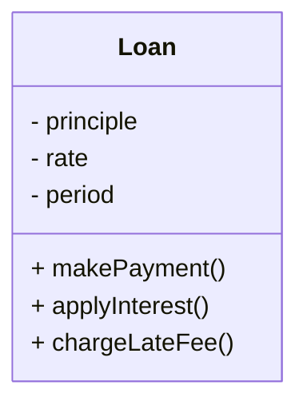

# 소개

클린아키텍처: 소프트웨어 구조와 설계의 원칙 책을 읽고 정리하며 소감을 적는 포스트입니다.

# 업무 규칙
애플리케이션을 업무 규칙과 플러그인으로 구분하려면 업무 규칙이 실제로 무엇인지를 잘 이해해야만 한다.

엄밀하게 말하면 업무 규칙은 사업적으로 수익을 얻거나 비용을 줄일 수 있는 규칙 또는 절차다. 더 엄밀하게 말하면 컴퓨터상으로 구현했는지와 상관없이, 업무 규칙은 사업적으로 수익을 얻거나 비용을 줄일 수 있어야 한다.

대출에 N% 이자를 부과한다는 사실은 은행이 돈을 버는 업무 규칙이다. 이건 사람이든 컴퓨터 프로그램이는 하등 관계가 없다.

이러한 규칙을 핵심 업무 규칙(Critical Business Rule)이라고 부를 것이다. 이들 규칙은 사업 자체의 핵심적이며, 규칙을 자동화하는 시스템이 없더라도 업무 규칙은 그대로 존재하기 때문이다.

핵심 규칙과 핵심 데이터는 본질적으로 결합되어 있기 때문에 객체로 만들 좋은 후보가 된다. 우리는 이러한 유형의 객체를 엔티티(Entity)라고 하겠다.

## 엔티티

엔티티는 컴퓨터 시스템 내부의 객체로서, 핵심 업무 데이터를 기반으로 동작하는 일련의 조그만 핵심 업무 규칙을 구체화한다. 엔티티 객체는 핵심 업무 데이터를 직접 포함하거나 핵심 업무 데이터에 매우 쉽게 접근할 수 있다.

인티티의 인터페이스는 핵심 업무 데이터를 기반으로 동작하는 핵심 업무 규칙을 구현한 함수들로 구성된다.

아래의 그림은 대출을 뜻하는 Loan 엔티티가 UML 클래스로 어떻게 표현되는지 보여준다. 세 가지 핵심 업무 데이터를 포함하며, 데이터와 관련된 세 가지 핵심 업무 규칙을 인터페이스로 제공한다.

> UML 클래스로 표현한 Loan 엔티티

이  클래스는 업무의 대표자로서 독립적으로 존재한다. 이 클래스는 데이터베이스, 사용자 인터페이스, 서드파티 프레임워크에 대한 고려사항들로 인해 오염되어서는 절대 안 된다.

`엔티티는 순전히 업무에 대한 것이며, 이외의 것은 없다.`

## 유스케이스

모든 업무 규칙이 엔티티처럼 순수한 것은 아니다. 자동화된 시스템이 동작하는 방법을 정의하고 제약함으로써 수익을 얻거나 비용을 줄이는 업무 규칙도 존재한다.

유스케이스는 자동화된 시스템이 사용되는 방법을 설명한다. 유스케이스는 사용자가 제공하는 입력, 사용자에게 보여줄 출력, 그리고 해당 출력을 생성하기 위한 처리 단계를 기술한다.

엔티티 내의 핵심 업무 규칙과는 반대로, 유스케이스는 애플리케이션에 특화된(application-specific) 업무 규칙을 설명한다.

유스케이스는 엔티티 내부의 핵심 업무 규칙을 어떻게 그리고 언제 호출할지를 명시하는 규칙을 담는다.

주목할 또 다른 사실은 인터페이스로 들어오는 데이터와 인터페이스에서 되돌려주는 데이터를 형식 없이 명시한다는 점만 빼면, 유스케이스는 사용자 인터페이스를 기술하지 않는다는 점이다. 유스케이스만 봐서는 애플리케이션이 웹을 통해 전달되는지, 리치 클라이언트인지, 콘솔인지 구분하기란 불가능하다.

> 유스케이스 예제

유스케이스는 시스템이 사용자에게 어떻게 보이는지를 설명하지 않는다. 이보다는 애플리케이션에 특화된 규칙을 설명하며, 이를 통해 사용자와 엔티티 사이의 상호작용을 규정한다. 시스템에서 데이터가 들어오고 나가는 방식은 유스케이스와는 무관하다.

유스케이스는 객체다. 유스케이스는 애플리케이션에 특화된 업무 규칙을 구현하는 하나 이상의 함수를 제공한다. 또한 유스케이스는 입력 데이터, 출력 데이터, 유스케이스가 상호작용하는 엔티티에 대한 참조 데이터 등의 데이터 요소를 포함한다.

왜 엔티티는 고수준이며, 유스케이스는 저수준일까? 왜냐하면 유스케이스는 단일 애플리케이션에 특화되어 있으며, 따라서 해당 시스템의 입력과 출력에 보다 가깝게 위치하기 때문이다.

## 요청 및 응답 모델

유스케이스는 입력 데이터를 받아서 출력 데이터를 생성한다. 제대로 구성된 유스케이스 객체라면 데이터를 사용자나 또 다른 컴포넌트와 주고 받는 방식에 대해서는 전혀 눈치챌 수 없어야 한다.

데이터 구조는 HttpRequest나 HttpResponse 같은 표준 프레임 워크 인터페이스로부터 파생되지 않는다. 웹뿐만 아니라 그 어떤 사용자 인터페이스에도 종속되는 게 아무것도 없다.

이 처럼 의존성을 제거하는 일은 매우 중요하다. 요청 및 응답 모델이 독립적이지 않다면, 그 모델에 의존하는 유스케이스도 결국 해당 모델이 수반하는 의존성에 간접적으로 결합되어 버린다.

엔티티와 요청/응답 모델은 상당히 많은 데이터를 공유하므로 엔티티를 요청/응답 모델에 참조를 걸고 싶은 유혹을 받을 수 있다.

하지만 두 객체의 목적은 완전히 다르며 시간이 지나면 두 객체는 완전히 다른 이유로 변경될 것이고, 따라서 두 객체를 어떻 식으로든 함께 묶는 행위는 공통 폐쇄 원칙과 단일 책임 원칙을 위배하게 된다.

## 결론

업무 규칙은 소프트웨어 시스템이 존재하는 이유다. 업무 규칙은 핵심적인 기능이다.

업무 규칙은 사용자 인터페이스나 데이터베이스와 같은 저수준의 관심사로 인해 오염되어서는 안 되며, 원래 그대로의 모습으로 남아 있어야 한다.

업무 규칙은 시스템에서 가장 독립적이며 가장 많이 재사용할 수 있는 코드여야 한다.