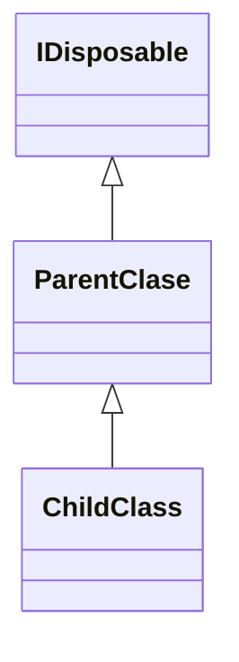

# 소개

C#에서는 가비즈 컬렉터(GC)가 메모리를 자동으로 관리합니다. 필요없는 클래스의 인스턴스를 메모리에서 바로 지우는 것이나라, 조건을 만족할 때까지 기다렸다가 지우기 때문에 클래스를 지웠다고 해도 메모리가 바로 해제 되지 않는다.

일반적인 메모리라면 GC에 맡겨도 상관 없지만, 관리되지 않는(Unmanaged, Native)리소스는 즉각 해제해야 하는 경우가 생기는데, 그럴때 필요한 것이 Dispose다.

## IDisposable 인터페이스

C#에서는 개발자가 명시적으로 메모리를 해제하기 위해서는 `IDisposable` 인터페이스를 상속 받아 구현한다.

IDisposable에서는 `Dispose()` 하나의 메서드만 제공한다.

```cs
public interface IDisposable
{
    void Dispose();
}
```

IDisposable.Dispose()는 다음 4가지 작업을 수행한다.
- 모든 비관리 리소스를 정리한다.
- 모든 관리 리소스를 정리한다.
- 객체가 이미 정리되었음을 나타내기 위한 상태 플래그 설정. 앞서 이미 정리된 객체에 대하여 추가로 정리 작업이 요청될 경우 이 플래그를 확인하여 ObjectDisposed예외를 발생시킨다.
- finalizer 호출 회피. 이를 위해 GC.SupressFinalize(this)를 호출한다.

#### IDisposable의 일반적인 사용법

* [MSDN 참고](https://docs.microsoft.com/ko-kr/dotnet/api/system.idisposable?view=net-6.0)

```cs
class DisposeExample 
{
    public class MyResource : IDisposable
    {
        private IntPtr Handle; // 외부 비관리 리소스 핸들
        private Component component = new Component(); // 관리 리소스
        private bool disposed = false; // Dispose가 호출되었는지 확인한다.

        public MyResource(IntPtr _Handle)
        {
            Handle = _Handle;
        }

        public void Dispose()
        {
            Dispose(disposing: true);

            // 사용자가 직접 Dispose()를 호출했기 때문에 
            // GC는 finalizer를 호출할 필요가 없다.
            // GC는 finalizer를 구현한 인스턴스에 대해 finalizer를 호출한다.
            GC.SuppressFinalize(this);
        }

        // disposing이 true인 경우 사용자가 직접 호출하여
        // 해당 인스턴스의 관리/비관리 리소스를 해제하고 있는 것이다.
        // disposing이 false인 경우, finalizer에 의해 호출되어
        // 다른 객체를 더 이상 참조하면 안되기 때문에 오직 비관리 리소스만 해제되어야한다.
        protected virtual void Dispose(bool disposing)
        {
            // 이미 리소스가 해제 되었는지 확인
            if (disposed == true)
            {
                return;
            }

            // 실제로 사용자가 호출한 경우에만 
            // 관리 리소스를 호출한다.
            if(disposing)
            {
                component.Dispose();
            }

            // 비관리 리소스를 해제하기 위해
            // 올바른 함수를 호출한다.
            CloseHandle(Handle);
            Handle = IntPtr.Zero;

            // 이제 해당 인스턴스는 모두 해제되었다.
            disposed = true;
        }

        // C# finalizer는 비관리 리소스만 해제해야한다.
        ~MyResource() => Dispose(disposing: false);
    }
}
```

`protected`로 선언된 가상 헬퍼함수(virtual hepler function)을 제공하는데 파생 클래스에게도 리소스를 정리하도록 제공할 수 있습니다.

```cs
protected virtual void Dispose(bool isDisposing);
```

- disposing이 true일 경우는 관리/비관리 리소스를 모두 해제 합니다.
- disposing이 false일 경우는 비관리 리소스만 정리합니다.
- 코드의 마지막 부분에서는 반드시 베이스 클래서에서 정의하는 Dispose를 호출해야만 합니다.


## 자식 클래스에서 Dispose 사용법



이미 BaseClass에서 IDisposable를 구현했을 때 Child 클래스에서만 사용하는 리소스의 메모리 해제 방법에 대해 알아봅니다.

```cs
class ParentClase : IDisposable
{
    private Component _parentComponent = new Component();
    private bool _disposed = false;

    ~ParentClase() => Dispose(false);

    public void Dispose()
    {
        Dispose(true);
        GC.SuppressFinalize(this);
    }

    protected virtual void Dispose(bool disposing)
    {
        if (_disposed)
        {
            return;
        }

        if (disposing)
        {
            _parentComponent.Dispose();
        }
        _disposed = true;
    }
}

class ChildClass : ParentClase
{
    bool _disposed = false;
    private Component _childComponent = new Component();

    ~ChildClass() => Dispose(false);

    protected override void Dispose(bool disposing)
    {
        if (_disposed)
        {
            return;
        }
        if (disposing)
        {
            _childComponent.Dispose();
        }

        _disposed = true;
        base.Dispose(disposing);
    }
}
```

위와 같이 `ParentClass`에서 `ChildClass`의 Dispose가 호출되는 것을 확인하지 않고 Dispose 해버리면 `ChildClass`의 메모리는 해제 되지 않습니다.

#### Dispose Pattern 구현 시 주의 사항

Dispose와 Finalizer는 방어적으로 작성되어야 합니다. Dispose 메서드는 한번 이상 호출 될 수 있으므로, 여러번 호출해도 문제가 없도록 구현해야 합니다.

만약 이미 정리된 객체에 대해 호출한 경우 `ObjectDisposedException`예외를 발생시키는 것 또한 Dispose 패턴의 규칙이다.

Dispose 메서드에서는 리소스 정리 작업만 수행해야 한다. Dispose나 Finalizer에서 다른 작업을 수행하게 되면 객체의 생명주기와 관련된 심각한 문제를 일으킬 수 잇따. 만약 Finalizer에서 객체에 접근하여 다른 작업을 수행하면 객체는 `Reachable` 상태로 되어 객체가 죽지 않고 다시 살아 날수 있다.